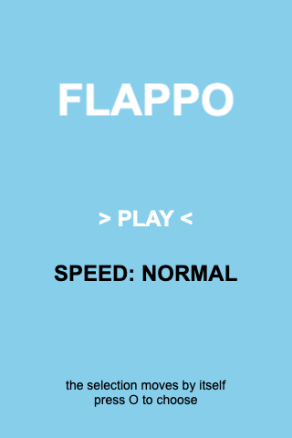
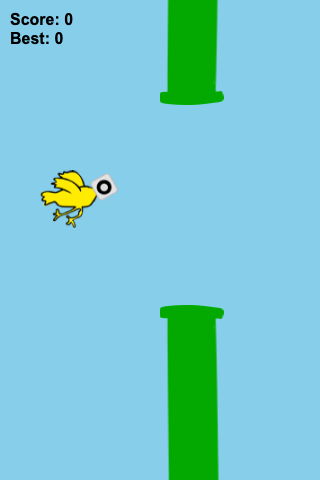
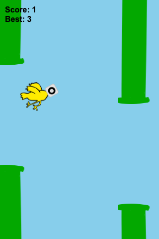

# Flappo (flappy but with the o key)

A Flappy Bird clone built with [Phaser CE](https://github.com/phaserjs/phaser-ce) (Phaser 2), with hand-drawn graphics.

<p align="center">
  
  
  
</p>

## How to play

The whole game is played with a single key: **O**.

In the start menu, the selection switches between PLAY and SPEED on its own. Press **O** to activate the highlighted line: PLAY starts the game, SPEED cycles between SLOW, NORMAL and FAST.

In game:

- Press the **O** key to flap
- Fly between the pipes to score points
- Hit a pipe, the ground or the ceiling and it's game over
- Your best score is saved in the browser

## Run the game

The game must be served by a web server (opening the file directly blocks image loading):

```bash
python3 -m http.server
```

Then open [http://localhost:8000](http://localhost:8000) in your browser.

## Files

| File | Purpose |
|---|---|
| `index.html` | The whole game: page + Phaser code |
| `bird.png` | Bird sprite |
| `pipe.png` | Pipe sprite (adapted to the game's aspect ratio) |
| `pipe-top.png` | Flipped pipe sprite, used for the top pipes |
| `screenshots/` | Screenshots used in this README |
| `bird-original.png`, `pipe-original.png` | Original drawings, kept for future edits |

Phaser CE is loaded from a CDN, there is nothing to install.

## Settings

A few variables at the top of `index.html` let you tweak the difficulty:

- `birdGravity`: gravity strength (default: 800)
- `birdFlapPower`: power of one flap (default: 300)
- `speeds`: the SLOW / NORMAL / FAST values offered in the menu
- `birdPipeInterval`: delay between pipes in ms (default: 2000)
- `pipeHole`: size of the gap between pipes (default: 200)
